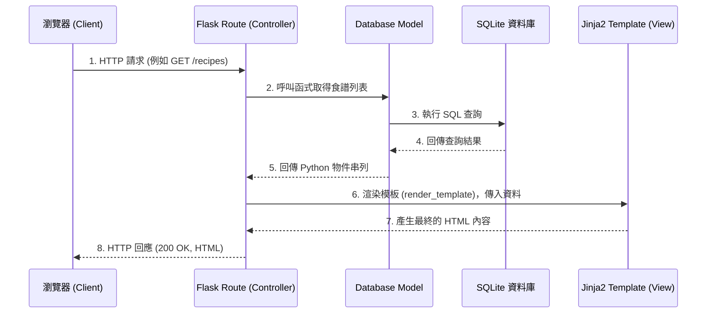

# 系統架構文件 (Architecture) - 食譜收藏夾

## 1. 技術架構說明

本專案為一個極度輕量化、以個人使用為導向的 Web 應用程式。為了達到最簡單的維護與部署，本系統採用不分離前後端的單體式架構 (Monolithic Architecture)。

### 選用技術與原因
- **後端框架**：`Python + Flask`
  - **原因**：Flask 是輕量級的 Python Web 框架，非常適合快速建置如個人 MVP 等小型專案。它沒有過多強制性的規範，可以讓我們保持彈性。
- **模板引擎**：`Jinja2`
  - **原因**：與 Flask 完美整合，直接透過伺服器渲染 HTML (Server-Side Rendering)，省去建置與維護前端框架（如 React/Vue）的複雜度與時間。
- **資料庫**：`SQLite`（搭配 SQLAlchemy，也可直接使用 sqlite3）
  - **原因**：不需要額外架設資料庫伺服器 (如 MySQL, PostgreSQL)，資料全部儲存在單一檔案 (`.db`) 中，對個人專案而言資料備份與遷移非常簡單。
- **前端樣式**：`Vanilla CSS` (或可考慮匯入 Bootstrap / Tailwind CDN)
  - **原因**：簡單且足夠實作出響應式設計 (RWD)，快速達成手機與電腦跨平台檢視。

### Flask MVC 模式說明
雖然 Flask 本身是 Micro-framework，但我們會遵循標準的 MVC (Model-View-Controller) 概念來組織程式碼：
- **Model (模型)**：負責與 SQLite 互動，定義食譜、標籤等資料的結構與讀寫邏輯。
- **View (視圖)**：Jinja2 所渲染出的 HTML，負責展示資料並接收使用者的點擊與輸入。
- **Controller (控制器)**：在 Flask 中由 **Routing (路由函式)** 擔任，負責接收 HTTP Request，向 Model 索取資料，然後將這些資料餵給 View 進行呈現。

---

## 2. 專案資料夾結構

為了讓專案具備良好的可維護性，採用以下清晰的資料夾劃分方式：

```text
web_app_development/
├── app/
│   ├── models/           ← 資料庫模型 (定義 Recipe, Tag 資料表與操作)
│   │   └── recipe.py
│   ├── routes/           ← Flask 路由 (Controller，處理各 URL 的請求)
│   │   └── recipe_routes.py
│   ├── templates/        ← Jinja2 HTML 模板 (View)
│   │   ├── base.html     ← 共用版型 (包含標頭、導覽列)
│   │   ├── index.html    ← 首頁/食譜列表頁
│   │   ├── detail.html   ← 食譜詳細檢視頁
│   │   └── form.html     ← 新增/編輯食譜頁面
│   └── static/           ← 靜態資源檔案
│       ├── css/
│       │   └── style.css ← 全域樣式表
│       └── js/
│           └── main.js   ← 需要在前端執行的互動邏輯 (如有)
├── instance/
│   └── database.db       ← SQLite 資料庫檔案 (需加入 .gitignore)
├── docs/                 ← 開發文件目錄
│   ├── PRD.md            ← 產品需求文件
│   └── ARCHITECTURE.md   ← 系統架構文件 (本文件)
├── app.py                ← Flask 應用程式進入點與初始化
├── requirements.txt      ← Python 套件相依清單
└── README.md             ← 專案說明文件
```

---

## 3. 元件關係圖

以下是系統各主要元件在一次典型的 HTTP Request/Response 中的互動過程：



---

## 4. 關鍵設計決策

1. **伺服器端渲染 (Server-Side Rendering)**
   - **決定**：不使用現代 SPA (Single Page Application) 架構，所有 HTML 都在後端用 Jinja2 組裝。
   - **原因**：這是個人自用的食譜系統，核心價值在於快速建置CRUD。SSR 開發速度最快，可以完全避免跨域 (CORS) 以及 API 設計的複雜度，有助於短時間內達成 MVP。
2. **採用單一檔案資料庫 (SQLite)**
   - **決定**：不建置 MySQL 或 PostgreSQL 服務器，且資料庫掛載在 `instance/` 目錄。
   - **原因**：使用者僅為「自己」，對併發寫入的要求極低。且未來如果要換電腦或備份，只需複製單一 `.db` 檔案即可，可攜性極高。
3. **Model 與 Route 分離**
   - **決定**：不要將所有程式碼都寫在 `app.py` 中。
   - **原因**：初期雖然簡單，但考慮到包含「材料」、「步驟」與「標籤」等不同資料實體，未來的路由會變多。獨立出 `models` 與 `routes` 資料夾可以保持程式碼整潔，降低維護成本。
