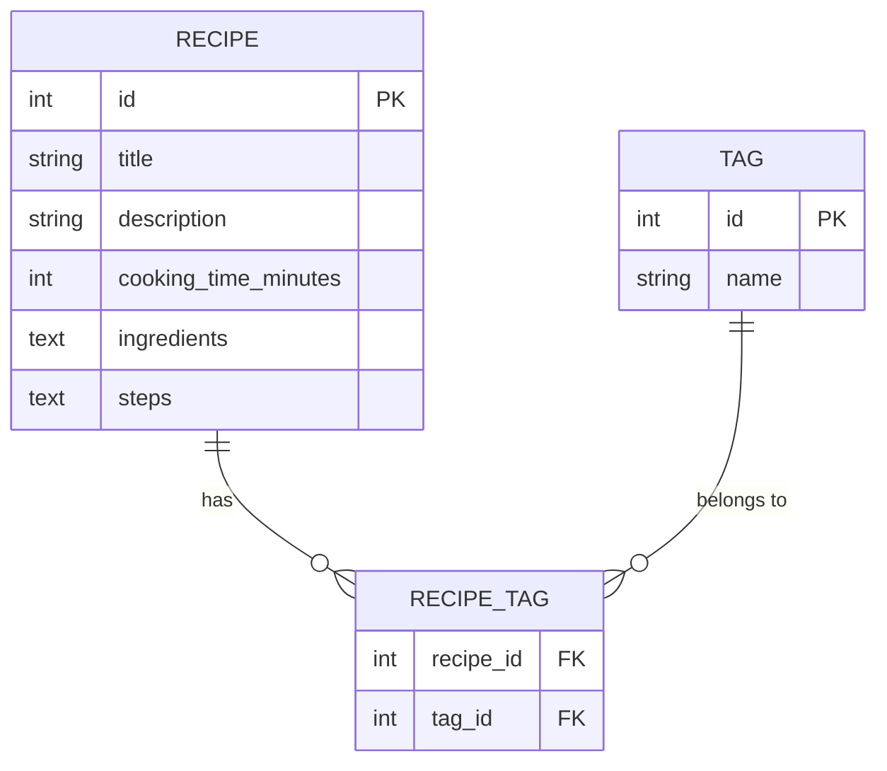

# DB Design Document

## ER Diagram

## Table Descriptions

### RECIPE
- **id**: INTEGER PRIMARY KEY AUTOINCREMENT
- **title**: TEXT NOT NULL – 食譜名稱
- **description**: TEXT – 食譜簡介
- **cooking_time_minutes**: INTEGER – 烹飪時間（分鐘）
- **ingredients**: TEXT – JSON 或換行分隔的材料列表
- **steps**: TEXT – 使用換行分隔的步驟說明

### TAG
- **id**: INTEGER PRIMARY KEY AUTOINCREMENT
- **name**: TEXT NOT NULL UNIQUE – 標籤名稱（例如：低脂、快炒）

### RECIPE_TAG (junction table for many‑to‑many relation)
- **recipe_id**: INTEGER NOT NULL, FOREIGN KEY REFERENCES RECIPE(id) ON DELETE CASCADE
- **tag_id**: INTEGER NOT NULL, FOREIGN KEY REFERENCES TAG(id) ON DELETE CASCADE
- Primary Key (recipe_id, tag_id)

## SQL Schema (SQLite)
The full CREATE TABLE statements are provided in `database/schema.sql`.
