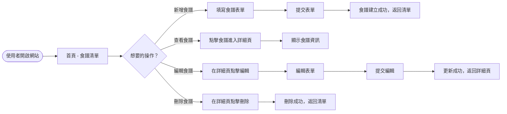

# 流程圖文件 (FLOWCHART)

## 使用者流程圖 (User Flow)



## 系統序列圖 (Sequence Diagram)

```mermaid
sequenceDiagram
    actor User as 使用者
    participant Browser as 瀏覽器
    participant Flask as Flask Route
    participant Model as 資料模型
    participant SQLite as SQLite 資料庫
    participant Jinja2 as Jinja2 模板

    User->>Browser: 開啟網站
    Browser->>Flask: GET /recipes
    Flask->>Model: 取得食譜列表
    Model->>SQLite: SELECT * FROM recipes
    SQLite-->>Model: 查詢結果
    Model-->>Flask: 食譜資料
    Flask->>Jinja2: render_template('index.html', data)
    Jinja2-->>Flask: HTML
    Flask-->>Browser: 回傳 HTML
    Browser-->>User: 顯示首頁

    User->>Browser: 點擊 "新增食譜"
    Browser->>Flask: GET /recipes/new
    Flask->>Jinja2: render_template('form.html')
    Jinja2-->>Flask: HTML表單
    Flask-->>Browser: 表單頁面
    User->>Browser: 填寫表單並送出
    Browser->>Flask: POST /recipes
    Flask->>Model: 新增食譜資料
    Model->>SQLite: INSERT INTO recipes ...
    SQLite-->>Model: 成功
    Model-->>Flask: 新增完成
    Flask->>Jinja2: redirect to /recipes
    Jinja2-->>Flask: 302
    Flask-->>Browser: 重導向
    Browser->>Flask: GET /recipes
    ... (同上顯示清單)
```

## 功能清單對照表

| 功能 | URL 路徑 | HTTP 方法 |
|------|----------|-----------|
| 新增食譜 | /recipes/new | GET |
| 新增食譜 (送出) | /recipes | POST |
| 列出食譜 | /recipes | GET |
| 食譜詳細 | /recipes/<id> | GET |
| 編輯食譜表單 | /recipes/<id>/edit | GET |
| 更新食譜 | /recipes/<id> | POST |
| 刪除食譜 | /recipes/<id>/delete | POST |
